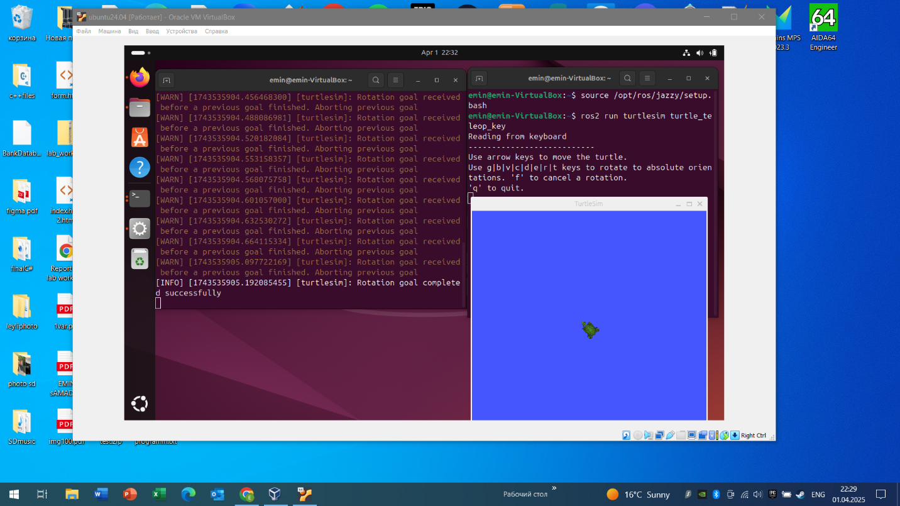
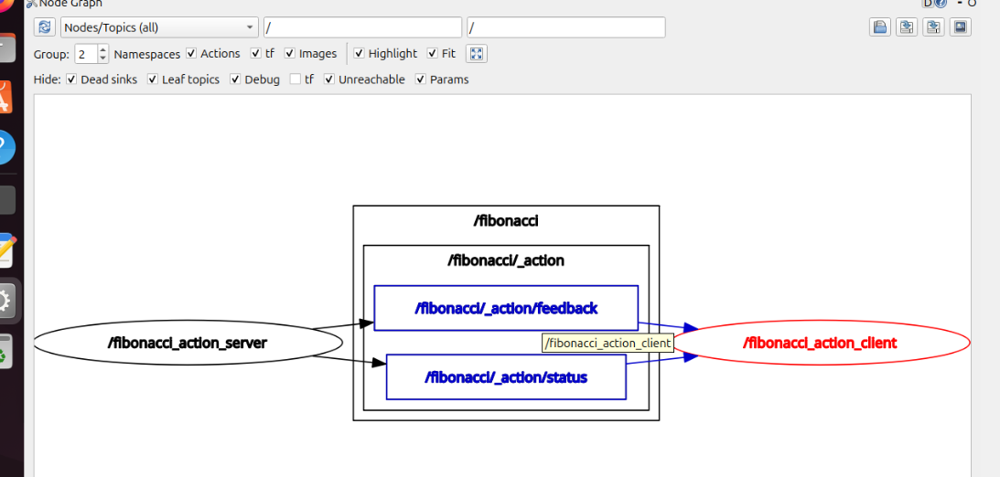
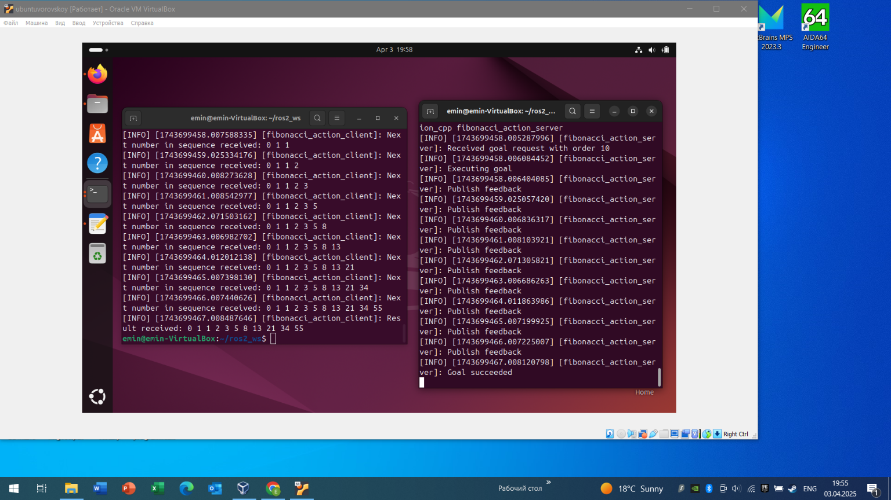

# ROS2 Custom Action in C++ (Fibonacci + Timer)

This repository contains a ROS2 C++ project demonstrating how to create and use a custom ROS2 Action with a client–server architecture.

The project includes:
- Custom action definition
- Action Server
- Action Client
- Feedback and result handling
- Timer-based automatic goal execution
- Execution visualization using `rqt_graph`

---

## Overview

ROS2 Actions are designed for long-running tasks that require:
- Goal handling
- Periodic feedback
- Final result reporting

This project implements a **Fibonacci sequence action** where:
- The server computes the Fibonacci sequence step-by-step
- The client sends a goal (e.g., `order = 10`)
- Feedback is sent during execution
- The final result includes execution timing in milliseconds

**Technologies Used:**
- ROS 2
- C++
- `rclcpp`
- `rclcpp_action`
- ROS2 Timers
- `rqt_graph`

---

## How It Works

### Action Server
- Accepts Fibonacci order as a goal
- Publishes feedback during computation
- Returns the final sequence and execution time

### Action Client
- Waits for server availability
- Sends a goal request
- Receives feedback updates
- Prints the final result

### Timer Integration

The client includes a ROS2 timer:
- **Interval:** random between 500–2000 ms
- Automatically sends a goal when triggered
- Stops after sending to prevent multiple simultaneous goals

This simulates real robotic systems where tasks are triggered periodically.

---

## Screenshots

### Turtlesim Action Example



---

### rqt_graph Visualization



---

### Node Communication (Client and Server)

This screenshot shows the communication flow between the action client and action server nodes, including goal, feedback, and result channels.



---

## Visualization

Execution flow can be visualized using:

```bash
rqt_graph
```

You can also test built-in action examples using:

```bash
ros2 run turtlesim turtlesim_node
ros2 run turtlesim turtle_teleop_key
```

---

## Repository Structure

```
ros2-custom-action-cpp/
│── action/
│── src/
│── include/
│── CMakeLists.txt
│── package.xml
│── README.md
│── images/
```

---

## Build and Run

**Clone the repository:**

```bash
git clone https://github.com/emins1856/ros2-custom-action-cpp.git
cd ros2-custom-action-cpp
```

**Build the workspace:**

```bash
colcon build
source install/setup.bash
```

**Run the action server:**

```bash
ros2 run <your_package_name> fibonacci_action_server
```

**Run the action client:**

```bash
ros2 run <your_package_name> fibonacci_action_client
```

---

## Example Output

```
Sending goal: order = 10
Feedback: [0, 1, 1, 2]
Feedback: [0, 1, 1, 2, 3, 5]
...
Result: [0, 1, 1, 2, 3, 5, 8, 13, 21, 34]
Execution time: 3 ms
```

---

## Learning Outcomes

This project demonstrates practical experience in:
- Designing custom ROS2 actions
- Implementing asynchronous client–server communication
- Using ROS2 timers for periodic execution
- Visualizing system architecture with `rqt_graph`
- Structuring a minimal ROS2 C++ package

---

## Author

**Emin Samadov**  
Software Engineering (Robotics Systems) — Vilnius University  
GitHub: [github.com/emins1856](https://github.com/emins1856)
